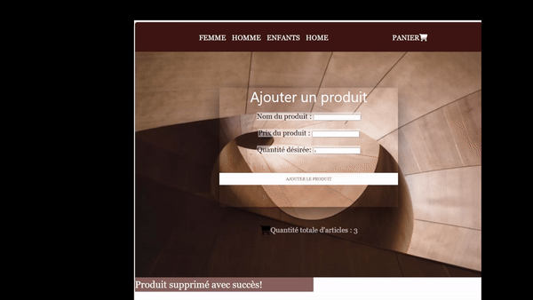

# 💻 Kenza | Développeuse Web en Formation

Bienvenue sur mon GitHub ! 
Je suis Kenza, actuellement en formation pour devenir développeuse web. 
Ce dépôt est le reflet de mon parcours, de mes compétences techniques et des projets concrets que j'ai réalisés tout au long de ma formation.

## 🌟 À propos de moi

Passionnée par le développement web, je m'intéresse particulièrement à la création d'interfaces utilisateurs modernes, fonctionnelles et intuitives. Mon objectif est de maîtriser les technologies du web, pour concevoir des applications performantes, tant sur le front-end que sur le back-end. À travers mes projets, je m'efforce de combiner **performance** et **expérience utilisateur**.

## 🛠️ Compétences Techniques

  <table>
    <tr>
      <td><strong>Langages & Technologies</strong></td>
      <td><strong>Frameworks & Outils</strong></td>
    </tr>
    <tr>
      <td>
        
         
        
         
        
         
        
         
        
      </td>
      <td>
        
         
        
         
        
         
        
         
        
         
        
      </td>
    </tr>
  </table>

### En cours d'apprentissage

je m'investis pleinement dans l'apprentissage de **Symfony**, afin d'approfondir mes compétences dans la création d'applications web.

## 🚀 Mes Projets

Voici un aperçu de quelques projets que j'ai réalisés pendant ma formation :

### 1. **Projet : [Forum](https://github.com/Kenza2912/forumPlateau_V2)**

Ce projet est une plateforme de discussion développée en PHP, permettant aux utilisateurs de créer et de participer à des discussions catégorisées.

   

### 2. **Projet : [Cinéma](https://github.com/Kenza2912/Cinema)**

Ce projet est une application web développée en PHP, destinée à gérer une base de données de films. 

  

### 3. **Projet : [Application](https://github.com/Kenza2912/premiere-application-web-php)**

Cette application PHP permet à un utilisateur de renseigner différents produits via un formulaire.

  

